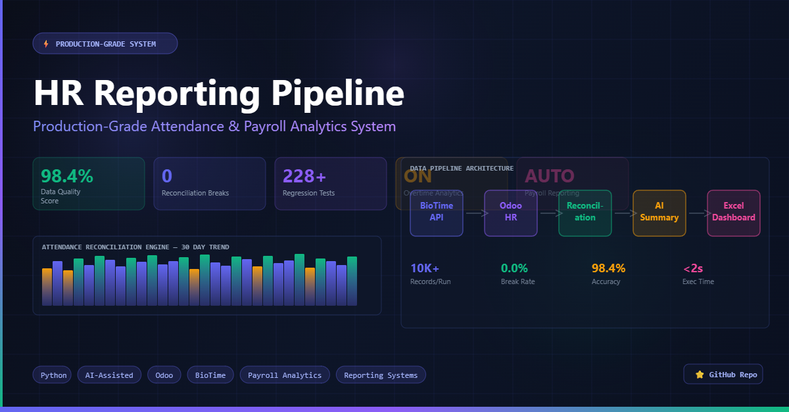

# HR Reporting Pipeline

[](https://github.com/Redha-Alkhulaqi/HR-Reporting-Pipeline/releases/tag/v1.0.0)
[](tests/)
[](https://www.python.org/)

<div align="center">



*Production-grade HR attendance and payroll analytics dashboard.*

</div>

> Monthly HR attendance reporting pipeline for organizations running **BioTime** punch devices and **Odoo** HR.

---

## 1. Project Overview

The **HR Reporting Pipeline** is a production-ready monthly reporting tool that:

- Ingests **BioTime** attendance punches (Check In / Check Out / Break In / Break Out).
- Ingests **Odoo HR** metadata (employee schedules from `resource.resource` and time off from `hr.leave`).
- Reconciles employee **identity**, **schedules**, **leaves**, **permissions**, **secondments**, **weekly off days**, and **public holidays**.
- Classifies every employee-day into one of five mutually exclusive statuses.
- Computes payroll-grade KPIs: lateness hours, overtime, early leave, breaks, absences, risk score, payroll deductions.
- Produces a multi-sheet **Excel dashboard** for HR / payroll review.
- Produces a **Claude-ready Markdown brief** that an LLM can turn into an executive monthly summary.

**Primary stakeholder:** HR department. The pipeline supplies the monthly numbers and the audit trail behind them.

---

## 2. Architecture

The pipeline runs as a single linear flow. Each step is a discrete module with explicit inputs and outputs.

```
 ┌──────────────────────────────────────────────────────────────────────┐
 │                       HR Reporting Pipeline                          │
 └──────────────────────────────────────────────────────────────────────┘

  1. Load BioTime attendance export        → data_loader.load_attendance_file
  2. Load Odoo Resources (schedules)       → data_loader.load_working_schedule_file
  3. Load Odoo Time Off                    → data_loader.load_time_off_file
  4. Apply Employee ID alias mapping       → data_loader.apply_employee_id_aliases
  5. Apply manual punch corrections        → manual_punch_corrections.apply_*
  6. Validate input files                  → validators.validate_*
  7. Build employee-date calendar          → metrics_calculator._build_absence_details
  8. Reconcile attendance vs schedules /   → metrics_calculator._build_absence_details
     leaves / permissions / secondments /     + _build_absence_audit
     holidays / weekly off
  9. Calculate HR metrics                  → metrics_calculator.calculate_metrics
 10. Generate Excel dashboard              → excel_exporter.build_workbook
 11. Generate Claude-ready Markdown        → ai_summary_generator.generate_claude_input
```

Each step is independently testable (see `tests/`). The flow is orchestrated by [src/main.py](src/main.py).

---

## 3. Current Features

### Attendance classification
- Five mutually exclusive statuses (priority order):
  **Missing Schedule** → **Leave** → **Approved Excuse** → **Late** → **On Time**.
- **Employee-specific schedule lookup** with multi-key matcher (EMP code → NBSP-normalized exact name → stripped-EMP name → unique substring). Handles real-world Odoo export quirks like non-breaking spaces inside names.
- **Split-shift handling**: morning + evening segment days reconcile correctly; matched-interval logic picks the segment the employee actually worked.
- **Night-shift wrap**: Check Out before Check In rolls to the next day.
- **Partial hourly excuse handling** (overlap between the delay window and an approved permission window).
- **Employee-specific weekly off** overrides via `data/employee_weekly_off.xlsx`, falling back to the global `WEEKLY_OFF_DAYS` default.

### Time-tracking KPIs
- **Late grace**: thresholds are checked, then the *full* lateness is counted.
- **Overtime analytics**: matched-interval-aware overtime detection, anomaly flags, dashboard KPIs, dedicated Overtime sheet, Top Overtime chart.
  - **Payroll multiplier (active):** A global **1.5x** premium is applied centrally after classification (config: `OVERTIME_PAY_MULTIPLIER`, default `1.5`). Raw duration fields (`overtime_minutes`, `total_overtime_hours`) are **preserved unchanged** for audit. Payable fields (`overtime_payable_minutes`, `total_overtime_payable_hours`, `overtime_multiplier`) run alongside. See [§14 — Overtime Payroll Multiplier](#14--overtime-payroll-multiplier) for the architecture and rounding rules.
- **Early leave analytics**: matched-interval-aware early-leave detection with anomaly flagging.
- **Break analytics**: pair-walked Break In / Break Out punches; informational only (never affects KPIs).
- **Break after-policy calculation**: first 60 minutes of break per day ignored; only the excess counts.
- **Missing check-out detection**.

### Identity & policy
- **Employee ID alias mapping** for legacy BioTime device IDs (`data/employee_id_aliases.xlsx`).
- **Manual punch correction workflow** with approval / evidence gates (`data/manual_forgotten_punches.xlsx`).
- **Policy-based employee exclusions** with per-KPI flags (`data/excluded_employees.xlsx`).
- **HIDE_EXCLUDED_EMPLOYEES_FROM_REPORT** flag — excluded employees disappear from every visible sheet.

### Absence & calendar
- **Per-employee, per-date absence ledger** that respects weekly off days, public holidays, attendance, and approved time off.
- **Permission / Vacation / Secondment** day counts (typed from `Time Off Type` keywords).
- **Reconciliation delta** per employee: scheduled_working_days vs (attended + permission + vacation + secondment + absence).

### Risk & payroll
- **Compound risk score** (0–100) combining late frequency, unexcused minutes, missing check-outs, and repeated excuses.
- **Configurable payroll deduction** with per-employee monthly cap.
- **HR audit flags**: chronic_lateness, repeated_missing_checkouts, excessive_excuses, no_assigned_schedule, attendance_anomaly.

### Data quality
- **`data_quality_score` (0–100)** summarizing orphans, missing schedules, missing check-outs, duplicates, invalid punches.
- **Schedule Lookup Audit** sheet: one row per (Employee ID, attendance name) explaining how the schedule was matched (or why not).
- **Absence Audit** sheet with per-employee reconciliation deltas.
- **Employee ID Alias Audit** sheet for remapped historical IDs.
- **Employee Reconciliation Details** sheet covering every Employee ID seen.

### Outputs
- Multi-sheet **Excel dashboard** with embedded charts.
- **Claude-ready Markdown brief** including an auto-generated Executive Summary.
- **Output versioning** under `outputs/YYYY-MM/`.

---

## 4. Data Quality & Reconciliation

The pipeline computes an auditable **`data_quality_score` (0–100)** that aggregates the following signals. Each is surfaced on the Dashboard and in the reconciliation sheets:

| Signal | Meaning |
|---|---|
| `orphan_attendance_records` | Punches whose employee name has no matching Odoo schedule (after EMP-code / NBSP normalization). |
| `missing_schedule_cases` | Employee-days where the employee has a Check In but the schedule lookup returns no shift. |
| `duplicate_employee_names` | Names that appear under more than one Employee ID (potential identity collision). |
| `missing_employee_ids` | Punch rows without an Employee ID. |
| `invalid_punches_count` | Punches whose `Punch State` is not one of `Check In / Check Out / Break In / Break Out`. |
| `incomplete_break_records` | Break In / Break Out punches that could not be paired into a complete break. |
| `employee_id_alias_records_mapped` | Punches whose Employee ID was remapped from a legacy BioTime device ID to the current Odoo ID. |
| `unscheduled_active_employees` | Employees with attendance but no schedule (Employee Master `Orphan (no schedule)` count). |
| `data_quality_score` | Composite 0–100 score; high means clean inputs. |

A clean run typically reports `data_quality_score ≥ 95`.

---

## Current Validation Snapshot

Latest successful production-style run for May 2026:

- Reporting population: 43 employees
- Data quality score: 98.4
- Missing schedule cases: 0
- Orphan attendance records: 0
- Missing employee IDs: 0
- Invalid punches: 0
- Absence audit reconciliation breaks: 0
- Employee ID alias records mapped: 453
- Friday compensation days: 2
- Overtime multiplier: 1.5x
- Test suite: 228 passing
- Release: v1.0.1 — Reconciliation Accuracy Fix

This confirms that all non-excluded employees satisfy the reconciliation invariant:

```text
scheduled_working_days
==
attended_days
+ permission_days
+ vacation_days
+ secondment_days
+ absence_days
```

---

## 5. Required Input Files

All files live under [data/](data/). Excel format (`.xlsx`) is required.

### Required (pipeline aborts without them)

| File | Source | Purpose |
|---|---|---|
| `data/attendance_raw.xlsx` | BioTime export | Punch events (one row per punch). |
| `data/Resources (resource.resource).xlsx` | Odoo `resource.resource` | Per-employee Working Time labels (used to derive shift start / end). |
| `data/Time Off Custom - Simplified Duration Calculation (hr.leave).xlsx` | Odoo `hr.leave` | Approved leaves, permissions, secondments. |

### Optional (graceful no-op when absent)

| File | Purpose |
|---|---|
| `data/employee_id_aliases.xlsx` | Map legacy BioTime device IDs → current Odoo Employee IDs. |
| `data/excluded_employees.xlsx` | Policy exclusions (owners, executives, exempt staff) with per-KPI flags. |
| `data/manual_forgotten_punches.xlsx` | HR-approved manual punch corrections (camera-verified, etc.). |
| `data/employee_weekly_off.xlsx` | Per-employee weekly-off overrides (Friday/Saturday vs Sunday/Saturday, etc.). |

---

## 6. Employee ID Alias Mapping

BioTime device replacements give an employee a new Employee ID, but their historical punches still carry the old ID. To keep monthly trends contiguous:

- Add a row to `data/employee_id_aliases.xlsx` mapping `Old Employee ID → Current Employee ID` (plus optional Employee Name, Source, Active flag, Notes).
- The mapping is applied **immediately after loading attendance and before validation**, so every downstream metric sees the canonical Employee ID.
- Per-row audit columns (`original_employee_id`, `mapped_employee_id`, `id_alias_applied`, `alias_source`) are attached to the attendance dataframe.
- The `Employee ID Alias Audit` sheet in the Excel report lists every active alias and the number of records it remapped.
- Inactive aliases (`Active = FALSE`) are skipped entirely.
- If an old ID maps to multiple current IDs, the first-seen wins and a warning is logged.

---

## 7. Manual Punch Corrections

For days where an employee genuinely worked but the device missed the punch (battery failure, sync gap, etc.), HR can supply approved manual corrections in `data/manual_forgotten_punches.xlsx`.

**Expected columns:**

| Column | Description |
|---|---|
| `employee_code` | Employee ID (matches BioTime). |
| `employee_name` | Display name (for the audit trail). |
| `date` | Date of the missed punch (YYYY-MM-DD). |
| `punch_type` | `Check In` or `Check Out`. |
| `corrected_time` | The HH:MM:SS the punch should have happened. |
| `approval_status` | Only `Approved` rows affect calculations. |
| `reason` | Free-text reason (camera review, manager attestation, etc.). |
| `notes` | Optional notes for HR audit. |

**Behavior:**

- Only rows with `approval_status = Approved` are applied. Anything else is logged to a `Manual Punch Rejections` audit sheet.
- Manual corrections are applied **before** the Employee ID alias remap so HR can correct under either old or new ID.
- The flag `ALLOW_OVERRIDE_EXISTING_PUNCH` (default `False`) controls whether a correction can overwrite a punch that already exists.

---

## 8. Employee Summary Sheet (Executive View)

The **Employee Summary** sheet exposes 12 columns aimed at HR / payroll review:

| # | Column | Type |
|---|---|---|
| 1 | Employee ID | Integer |
| 2 | First Name | String |
| 3 | No of Absence Days | Integer (audited absence ledger) |
| 4 | No of Permission Days | Integer (hourly permission / استئذان) |
| 5 | No of Vacation Days | Integer (Annual / Sick / etc.) |
| 6 | No of Secondment Days | Integer (انتداب) |
| 7 | Total Late (Hours) | Decimal (1 dp) |
| 8 | Total Over Time (Hours) (Actual) | Decimal (1 dp) |
| 9 | Total Over Time (Payable 1.5x) (Hours) | Decimal (1 dp; green highlight) |
| 10 | Total Early Leave (Hours) | Decimal (1 dp) |
| 11 | Break Time (Hours) | Decimal (1 dp) |
| 12 | Break Time (After Policy) | Decimal (1 dp) |

> **Overtime audit note:** Actual overtime hours are preserved for audit and operational analysis. Payable overtime hours apply the global 1.5x payroll multiplier (config: `OVERTIME_PAY_MULTIPLIER`). Per-row payable minutes are rounded half-up to the nearest minute; hour values display to 1 dp. Worked examples (1 dp display): `10.5 → 15.8`, `4.2 → 6.3`, `39.4 → 59.1`. The Payable column is highlighted in green on the Employee Summary sheet, and an explanatory Notes block is appended below the data. See [§14](#14--overtime-payroll-multiplier) for the architecture.

### Business definitions

- **Late grace is threshold only.** If the unexcused delay ≤ **15 minutes**, count 0. If > 15 minutes, count the **full** lateness.
- **Early leave grace is threshold only.** If the early-leave gap ≤ **5 minutes**, count 0. If > 5 minutes, count the **full** early leave.
- **Break after policy.** The **first 60 minutes** of break per day are ignored; only the excess is counted.

These thresholds are independent of the per-row classification grace and are dedicated to the executive view so the published hours align with policy.

---

## 9. Example Metrics

A representative monthly run:

```
data_quality_score: 97.4
orphan_attendance_records: 0
missing_schedule_cases: 0
employee_id_alias_records_mapped: 453
overtime_hours: 230.3
early_leave_cases: 18
total_break_count: 210
```

Every KPI is reproducible from the Excel audit sheets (Reconciliation, Schedule Lookup Audit, Absence Audit, Employee ID Alias Audit).

---

## 10. Quick Start

```powershell
# One-time setup
python -m venv .venv
.\.venv\Scripts\Activate.ps1
pip install -r requirements.txt

# Drop the monthly exports into data/, then run:
python src/main.py
```

### Period filters

```powershell
python src/main.py --month 2026-05                       # one calendar month
python src/main.py --from 2026-05-01 --to 2026-05-15     # custom range
```

`--month` is mutually exclusive with `--from / --to` and expands to that month's bounds.

### Running tests

```powershell
python -m pytest tests/
```

The suite covers metrics, validators, time-off logic, overtime, early leave, breaks, exclusions, split shifts, ID aliases, manual punch corrections, schedule lookup, executive summary, and hide-excluded behavior (**119 tests** across 13 modules).

---

## 11. Output Files

| Path | Content |
|---|---|
| `outputs/YYYY-MM/hr_report_YYYYMMDD_HHMMSS.xlsx` | Multi-sheet Excel report (Dashboard, Employee Summary, Daily Attendance, Daily Trend, Overtime, Early Leave, Schedule Lookup Audit, Absence Details, Absence Audit, Employee ID Alias Audit, Employee Reconciliation Details, Employee Master, Break Summary, etc.). |
| `outputs/YYYY-MM/claude_hr_report_input.md` | Claude-ready Markdown brief with an auto-generated Executive Summary, KPI Highlights, Risk Analysis, Overtime Analysis, Department Breakdown, and Manual Review items. |
| `logs/pipeline.log` | Run log with validation warnings, alias mapping notes, schedule-lookup misses, and any data quality concerns. |

Files are versioned per month under `outputs/YYYY-MM/`; previous runs are never overwritten.

---

## 12. Known Limitations

- **Public holiday calendar.** Holidays are configured in `config.py` (`PUBLIC_HOLIDAYS`). Future versions may integrate a country-specific holiday API.
- **Accuracy depends on fresh exports.** Stale Odoo or BioTime extracts (an employee added to Odoo *after* the export) will surface as Missing Schedule. The Schedule Lookup Audit sheet calls these out explicitly.
- **Fuzzy matching is intentionally minimized.** The schedule matcher prefers EMP code and exact normalized matches and only falls back to substring matching when the result is unambiguously unique — to avoid silently picking the wrong twin.
- **Manual corrections require HR approval discipline.** Only rows with `approval_status = Approved` are honored; others land in a rejection audit sheet.
- **Live Odoo pull is not yet wired.** The `src/odoo_client.py` XML-RPC scaffold is in place but production currently consumes static XLSX exports.

---

## 13. Release History

### v1.0.0 — HR Reporting Pipeline (2026-05)

- Production-ready monthly attendance reporting pipeline.
- Employee ID alias mapping for legacy BioTime device IDs.
- Manual punch correction workflow with approval / evidence gates.
- Overtime / early-leave / break analytics with anomaly flagging.
- Executive Excel dashboard with 11-column Employee Summary, Schedule Lookup Audit, Absence Audit, Employee ID Alias Audit, and Employee Reconciliation Details sheets.
- Robust schedule matching: EMP-code, NBSP-normalized name, stripped-EMP name, unique substring (in that order).
- Per-employee weekly-off overrides.
- Policy-based per-KPI exclusions with optional "hide excluded from report" flag.
- Compound risk scoring and configurable payroll deduction estimation.
- Auditable data quality scoring.
- Claude-ready Markdown brief generation.
- 119-test pytest suite covering every business rule.

Full release notes: <https://github.com/Redha-Alkhulaqi/HR-Reporting-Pipeline/releases/tag/v1.0.0>

---

## 14. Overtime Payroll Multiplier

> **Current behavior:** A global **`1.5x`** payroll premium is applied to every minute of overtime AFTER classification. Raw physical duration fields are preserved unchanged. The multiplier is the single config constant `OVERTIME_PAY_MULTIPLIER` (env-overridable; set to `1.0` to disable the premium without touching code).

### Architecture

```
raw punches
  → _classify_overtime_row              (standard matched-interval)
  → _classify_total_span_minus          (TOTAL_SPAN_MINUS_8H override)
  → _apply_overtime_payroll_adjustment  ← centralized multiplier layer
  → aggregation (summary totals, top-N, executive view)
```

The multiplier is applied **once** in `_apply_overtime_payroll_adjustment` (in [src/metrics_calculator.py](src/metrics_calculator.py)), AFTER every overtime classifier — standard or special policy — has produced a physical-duration `overtime_minutes`. Individual policy branches never need to know about the multiplier.

### Fields

Raw (preserved, never mutated):

| Field | Scope | Description |
|---|---|---|
| `overtime_minutes` | per-row | Physical overtime in minutes. |
| `overtime_status` | per-row | `Overtime` / `No Overtime` / `Missing Check Out` / `Missing Schedule`. |
| `total_overtime_minutes` | summary | Sum across rows (excludes employees flagged `Exclude From Overtime`). |
| `total_overtime_hours` | summary | `total_overtime_minutes / 60`, 1 dp. |
| `avg_overtime_minutes` | summary | Mean per overtime case. |

Payroll-adjusted (new, parallel):

| Field | Scope | Description |
|---|---|---|
| `overtime_multiplier` | per-row + summary | The multiplier used (currently `1.5`). |
| `overtime_payable_minutes` | per-row | `round_half_up(overtime_minutes * multiplier)`. |
| `overtime_payable_hours` | per-row | `overtime_payable_minutes / 60`, 1 dp. |
| `total_overtime_payable_minutes` | summary | Sum across the same rows as the raw total. |
| `total_overtime_payable_hours` | summary | `total_overtime_payable_minutes / 60`, 1 dp. |

### Rounding

Payable minutes are computed as `overtime_minutes * multiplier` and rounded **half-up** to the nearest minute (Python's built-in `round()` uses banker's rounding, which is unintuitive for payroll). Examples at the default `1.5x`:

| Raw | Payable |
|---|---|
| `2:00` (120 min) | `3:00` (180 min) |
| `1:30` (90 min) | `2:15` (135 min) |
| `0:45` (45 min) | `1:08` (68 min — 67.5 rounds up) |
| `0:30` (30 min — floor) | `0:45` (45 min) |
| `0:00` | `0:00` |

### How to change the multiplier

1. Set the env var: `OVERTIME_PAY_MULTIPLIER=1.25` (or whatever) and rerun the pipeline.
2. Or edit the default in [src/config.py](src/config.py).

The raw fields are unaffected. Auditors can always reproduce the payable totals as `raw_total * multiplier` with half-up rounding per row.

### Per-employee overrides

The current implementation applies one global multiplier. If per-employee multipliers become necessary, the natural extension is to add a `Multiplier` column to [data/overtime_policy_overrides.xlsx](data/) and have `_apply_overtime_payroll_adjustment` look up the multiplier per row before computing the payable minutes. The centralized location of the helper means this change touches one function only.

### Hard rule (do not violate)

**Never apply the multiplier inside `_classify_overtime_row` or `_classify_total_span_minus`.** Those compute physical durations and are consumed by many downstream calculations (early leave, anomaly flags, executive summary, Claude brief). Mixing pay-rate math into the duration would silently inflate every dependent KPI.

---

## Documentation

- [AGENTS.md](AGENTS.md) — full agent / contributor instructions for working on this codebase.
- [HR_REPORTING_RULES_MASTER.md](HR_REPORTING_RULES_MASTER.md) — authoritative business rules (lateness, leaves, status priorities).
- [MONTHLY_HR_REPORTING_WORKFLOW.md](MONTHLY_HR_REPORTING_WORKFLOW.md) — the monthly operating workflow.
- [docs/ARCHITECTURE.md](docs/ARCHITECTURE.md) — module relationships and design decisions.
- [CHANGELOG.md](CHANGELOG.md) — detailed release notes.

---

## License

Internal HR tooling. See repository owner for distribution terms.
